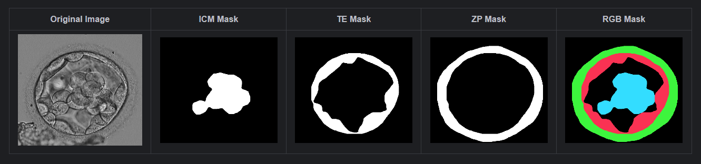
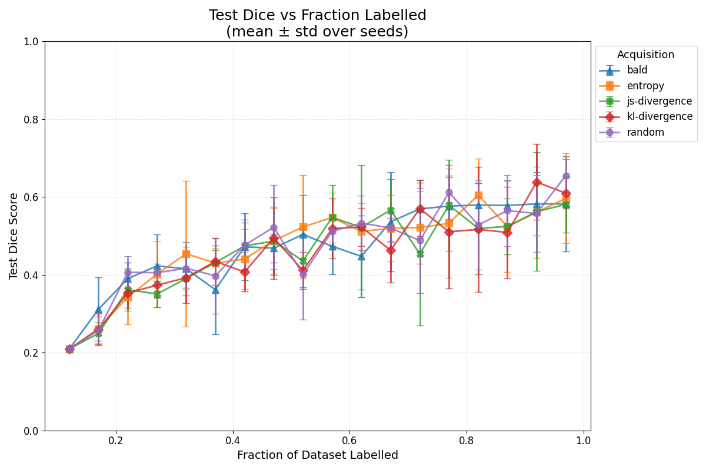

# Active Bayesian U-Net


This project is an implementation of **an Active Leraning Framework based on Bayesian U-Net** to improve the segmentation of
**human embryo images**. The objective is to optimize **annotation** efforts while maintaining high segmentation
performance.
> *Note:*
This implementation is based on the research paper [Active Learning with Bayesian U-Net for Efficient Semantic Image Segmentation by Isah Charles Saidu and Lehel Csató](https://doi.org/10.3390/jimaging7020037).


## Table of Contents

- [Repository Structure](#repository-structure)
- [Dependency Graph](#dependency-graph)
- [Data Preparation](#data-preparation)
- [Prerequisites](#prerequisites)
- [Running the Project on kaggle](#Running-the-Project-on-kaggle)
- [Implementation Details](#implementation-details)
- [Contact](#contact)

## Repository Structure

```
Active-Bayesian-U-Net/
└── docs/                         # contains images for the README.md file
└── examples/                     # contains examples of images and their masks
└── src/ 
    ├── mask_converter.py        # To Convert the 3 binary masks (ICM, TE, ZP) into an RGB mask                     
    ├── active_learning_loop.py  # Active Learning Pipeline implementation 
    ├── acquisition_functions.py # random, Entropy, BALD, KL-Divergence, JS-Divergence
    ├── active_learning_utils.py # resetting and creating active learning pools, scoring and moving unlabeled data
    ├── bayesian_unet_parts.py   # DoubleConv, Down, Up, OutConv
    ├── bayesian_unet.py         # Bayesian U-Net implementation
    ├── train_eval.py            # train and evaluate one epoch
    ├── metrics.py               # Evaluation metrics (Dice, accuracy)
    ├── data_loading.py          # Preprocessing and Loading the Blastocyst Data
    
└── .gitignore
└── requirements.txt
└── README.md

```

> *Note: Update file names as needed to match your codebase.*

## Dependency Graph

<p align="center">
  
</p>

## Data Preparation

> **Note:** The full dataset is private, but three example images and corresponding RGB masks are included in the `examples/` folder.

The original dataset consisted of four folders:

- `images/`: original grayscale blastocyst images  
- `ICM_MASK/`: binary mask for Inner Cell Mass  
- `TE_MASK/`: binary mask for Trophectoderm  
- `GT_MASK/`: binary mask for Zona Pellucida (Ground Truth)

We merged these three binary masks into a single RGB mask so that each class is colour-coded:

- **Blue** channel: Inner Cell Mass (ICM)  
- **Red** channel: Trophectoderm (TE)  
- **Green** channel: Zona Pellucida (ZP)

Below is a table showing an example blastocyst image, its three binary masks (ICM, TE, ZP), and the combined RGB mask:

<p align="center">
  
</p>


## Prerequisites

- Python 3.11.11 or higher
- Core Packages: torch,matplotlib, tqdm, numpy, Pillow, pandas
> *Note: Check requirements.txt*

## Running the Project on kaggle
Follow these steps in a Kaggle notebook to reproduce the experiments:

1. **Import the Dataset**  
   - In your Kaggle notebook, click **Add data** and select the `Blastocyst dataset`.

2. **Clone the GitHub Repository**  
    ```bash
    !git clone https://github.com/your-username/Active-Bayesian-U-Net.git

3. **Install Dependencies**
    ```bash
   %pip install -r Active-Bayesian-U-Net/requirements.txt

4. Prepare the Data Directory
   - Create a local data folder and copy images & masks from the Kaggle dataset
    
   ```bash
    # ← edit this to match your dataset’s folder under /kaggle/input
    DATASET_PATH="<PATH_TO_EMBRYO_DATASET>"   # e.g. /kaggle/input/embryo-images-and-masks

    # where you want to store a local copy
    WORKING_DATA="/kaggle/working/data"

    # create the directory
    mkdir -p "$WORKING_DATA"

    # copy images & masks
    cp -r "$DATASET_PATH/images" "$WORKING_DATA/"
    cp -r "$DATASET_PATH/masks"  "$WORKING_DATA/"

5. Add the Source to Your Python Path
    ```bash
   import sys
    sys.path.append("/kaggle/working/Active-Bayesian-U-Net/src")

6. Launch an active learning loop
    - Feel free to adjust any of the parameters below to suit your needs
    ```Python
   from active_learning_loop import active_learning_loop

    df = active_learning_loop(
        BASE_DIR         ="/kaggle/working/data",
        LABEL_SPLIT_RATIO =0.1,
        TEST_SPLIT_RATIO  =0.2,
        sample_size       =10,
        acquisition_type  ="random",
        mc_runs           =5,
        num_epochs        =5,
        batch_size        =4,
        lr                =1e-3,
        loop_iterations   =None,
        seed              =0,
        device            ="cuda"
    )

7. Run experiments to compare different acquisition functions
- Feel free tro adjust any of the parameters below to suit your needs
    ```Python
   from active_learning_utils import (
    collect_active_learning_results,
    plot_active_learning_results
    )
   
    # 1) Gather results
    df = collect_active_learning_results(
        BASE_DIR='/kaggle/working/data',
        seeds=[0,1,2,3,4],
        acquisition_funcs=["random","entropy","bald","kl-divergence","js-divergence"],
        label_split_ratio=0.1,
        test_split_ratio=0.2,
        sample_size=10,
        mc_runs=5,
        num_epochs=5,
        batch_size=4,
        lr=1e-3,
        loop_iterations=None,
        device='cuda'
    )

    # 2) Visualise
    plot_active_learning_results(
       df,
       ylim=(0, 1),
       figsize=(12, 8),
       markers=None
    )

## Implementation Details

### Data Encoding & Preprocessing

#### Mask Encoding
I used **label encoding** to convert colour‐coded masks into integer class labels for training. Each pixel’s RGB value is mapped to a class index as follows:

* Inner Cell Mass (ICM, blue channel) → 0

* Trophectoderm (TE, red channel) → 1

* Zona Pellucida (ZP, green channel) → 2

* Background (black) → 3

#### Size Standardization
To ensure all inputs share the same spatial dimensions, every grayscale image and its corresponding mask are padded (using ImageOps.pad) to a fixed size of 624×480 pixels. 
This preserves the original aspect ratio, fills any extra borders with background values, and guarantees consistent tensor shapes for efficient batched training.

### Bayesian U-Net Architecture


### Active Learning Pipeline


#### Splitting the Data Pool 


>*Note: You can tweak the splitting ratios | check active_learning_pool.py*

#### Training and Evaluation
##### Loss and Metrics
* Loss function: **nn.CrossEntropyLoss** on class indices for 4-way segmentation.

`nn.CrossEntropyLoss` computes the following for each sample:

$$
\text{Softmax: } p_j = \frac{e^{z_j}}{\sum_k e^{z_k}}
$$

$$
\text{Negative log-likelihood: } \ell = -\ln\bigl(p_{y}\bigr)
$$

$$
\text{Batch reduction (mean over }N\text{ samples): } 
\mathcal{L} = \frac{1}{N}\sum_{i=1}^{N} \ell^{(i)}
$$


* Metrics: (implemented in `src/metrics.py`):

$$
\text{Dice coefficient: }\quad 
\mathrm{Dice} = \frac{2\,\lvert P \cap G\rvert}{\lvert P\rvert + \lvert G\rvert}
$$

<p align="center">
  
</p>

$$
\text{Pixel accuracy: }\quad 
\mathrm{Accuracy} = \frac{\text{correct pixels}}{\text{total pixels}}
$$

#### Acquisition Functions

##### Notation

- (i = 1, ..... , B\) indexes the **image** in a batch of size \(B\).

- \(c = 1, ..... , C\) indexes the **class** channel (C = 4) in your case).

- \(t = 1, ..... , T\) indexes the **Monte Carlo** forward pass (dropout sample).

- (x,y) denotes spatial pixel coordinates.

- $$z^{(t)}_{i,c}(x,y)$$ is the logit for image \(i\), class \(c\), pixel \((x,y)\) on pass \(t\).

- The softmax probability on pass \(t\) is then:

$$p^{(t)}(i,c)(x,y) = \frac{\exp\left(z^{(t)}(i,c)(x,y)\right)}{\sum_{k=1}^C \exp\left(z^{(t)}(i,k)(x,y)\right)}$$
---

##### 1. Random sampling

$$
s_i = U(0,1)
$$

---

##### 2. Entropy sampling

1. **Mean predictive**

$$
\bar p_{i,c}(x,y) = \frac{1}{T} \sum_{t=1}^T p^{(t)}_{i,c}(x,y).
$$

2. **Entropy map**

$$
H_i(x,y) = -\sum_{c=1}^C \bar p_{i,c}(x,y)\,\ln \bar p_{i,c}(x,y).
$$

3. **Image score**

$$
s_i = \frac{1}{H\,W} \sum_{x=1}^H \sum_{y=1}^W H_i(x,y).
$$

---

##### 3. BALD

##### 1. Predictive entropy**

$$
H\bigl[\bar p_i(x,y)\bigr] = -\sum_{c=1}^C \bar p_{i,c}(x,y)\,\ln \bar p_{i,c}(x,y).
$$

##### 2. Expected Entropy

The expected entropy over the T MC passes is:

$$\mathbb{E}\left[H\left[p^{(t)}(i)(x,y)\right]\right] = \frac{1}{T} \sum_{t=1}^T \left[ -\sum_{c=1}^C p^{(t)}(i,c)(x,y) \ln p^{(t)}(i,c)(x,y) \right]$$

##### 3. BALD Map & Score

The pixel-wise BALD (Bayesian Active Learning by Disagreement) map is:

$$\mathrm{BALD}_i(x,y) = H\bigl[\bar p_i(x,y)\bigr] - \mathbb{E}_t\bigl[H\bigl(p^{(t)}_i(x,y)\bigr)\bigr]$$

The image-level acquisition score is:

$$s_i = \frac{1}{H\,W} \sum_{x=1}^H \sum_{y=1}^W \mathrm{BALD}_i(x,y)$$

##### 5. Committee KL-Divergence

1. **Posterior mean**:
   $$\bar p_{i,c}(x,y) = \frac{1}{T}\sum_{t=1}^T p^{(t)}_{i,c}(x,y)$$

2. **Deterministic prediction** (no dropout):
  $\mathbb{E}\big[H\big[p^{(t)}(i)(x,y)\big]\big] = \frac{1}{T} \sum_{t=1}^T \Big[ -\sum_{c=1}^C p^{(t)}(i,c)(x,y) \ln p^{(t)}(i,c)(x,y) \Big]$
3. **KL map & score**:
  $KL_i = \sum_{c=1}^C p_{ic} \ln(p_{ic} / q_{ic})$
   
   $$s_i = \frac{1}{H\,W} \sum_{x=1}^H \sum_{y=1}^W \mathrm{KL}_i(x,y)$$

##### 6. Committee JS-Divergence

Let:
$$Q_{i,c}(x,y) = \bar p_{i,c}(x,y), \quad p^*_{i,c}(x,y)$$

Define the mixture:
$$M_{ic}(x,y) = \frac{1}{2}(p_{ic}^*(x,y) + Q_{ic}(x,y))$$

The per-pixel JS divergence is:
$$\mathrm{JS} = \frac{1}{2} \sum_{c=1}^C p_{c} + \frac{1}{2} \sum_{c=1}^C Q_{c}$$

Finally, the image-level JS score is:
$$s_i = \frac{1}{H\,W} \sum_{x=1}^H \sum_{y=1}^W \mathrm{JS}_i(x,y)$$

## Results
<p align="center">
  
</p>

## Contact

If you have any questions or suggestions, please open an issue or contact the maintainer at `<https://www.linkedin.com/in/mohamed-heni-178a9819b/>`.

